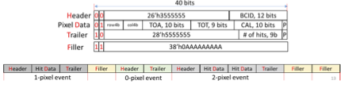

# Unpacker

Software unpacker for preliminary ETROC data format.

This package can create random hit data for the ETROC emulator data format specified [here](https://gitlab.cern.ch/cms-etl-electronics/etroc-emulator/-/blob/master/ETROC%20emulator%20version%201/ETROC_Emulator_20210825.pdf),
and can subsequently unpack it to reconstruct hits on the 16x16 sensor.

An example hex dump of ETROC data from the emulator v1 is [here](https://gitlab.cern.ch/cms-etl-electronics/module_test_sw/-/blob/master/output/dump.txt).



## Examples

A simple unpacker of ETROC emulator data can be run with
```
julia read_dump.jl
```

The output shows the overall event count and a hit map of the first event.
It should look something like this:
```
Number of Events: 143
Number of filler words: 0
Hit matrix of event 1 after hex dump:
Map of hits:
X  O  O  O  O  O  O  O  O  O  O  O  O  O  O  O
O  O  O  O  O  O  O  O  O  O  O  O  O  O  O  O
O  O  O  O  O  O  O  O  O  O  O  O  O  O  O  O
O  O  O  O  O  O  O  O  O  O  O  O  O  O  O  O
O  O  O  O  O  O  O  X  O  O  O  O  O  O  O  O
O  O  O  O  O  O  O  O  O  O  O  O  O  O  O  O
O  O  O  O  O  O  O  O  O  O  O  O  O  O  O  O
O  O  O  O  O  O  O  O  O  O  O  O  O  O  O  O
O  O  O  O  O  O  O  O  O  O  O  O  O  O  O  O
O  O  O  O  O  O  O  O  O  O  O  O  O  O  O  O
O  O  O  O  O  O  O  O  O  O  O  O  O  O  O  O
O  O  O  O  O  O  O  O  O  O  O  O  O  O  O  O
O  O  O  O  O  O  O  O  O  O  O  O  O  O  O  O
O  O  O  O  O  O  O  O  O  O  O  O  O  O  O  O
O  O  O  O  O  O  O  O  O  O  O  O  O  O  O  O
O  O  O  O  O  O  O  O  O  O  O  O  O  O  O  O
```

