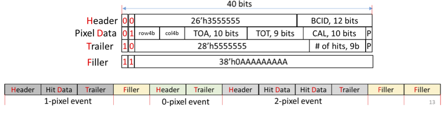

# Unpacker

Software unpacker for preliminary ETROC data format.

This package can create random hit data for the ETROC emulator data format specified [here](https://gitlab.cern.ch/cms-etl-electronics/etroc-emulator/-/blob/master/ETROC%20emulator%20version%201/ETROC_Emulator_20210825.pdf),
and can subsequently unpack it to reconstruct hits on the 16x16 sensor.

An example hex dump of ETROC data from the emulator v1 is [here](https://gitlab.cern.ch/cms-etl-electronics/module_test_sw/-/blob/master/output/dump.txt).

